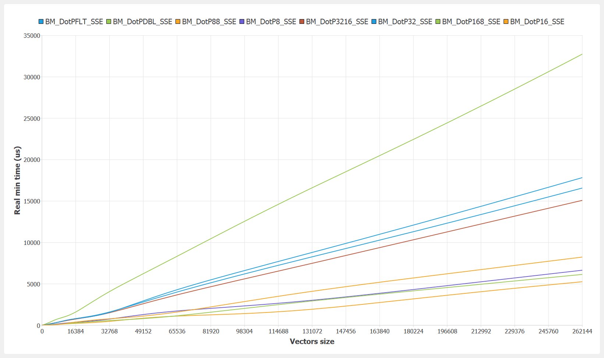

# Dot Product - x86

Benchmark configuration:
- OS: Windows 10 64-bits
- Compiler: MinGW 8.1.0 64-bits
- Flags: -O2 -DNDEBUG -march=native -mtune=native
- CPU: i7-10875h (L1-D 32K, L1-I 32K, L2 256K, L3 16M) (turbo mode disabled)
- Options: no data alignement, max vector size multiple, inner loop '200'

### SSE

### AVX

### int8 x int8

### int8 x uint8

### int16 x int8

### int16 x int16

### int32 x int16

### int32 x int32

### float x float

### double x double

