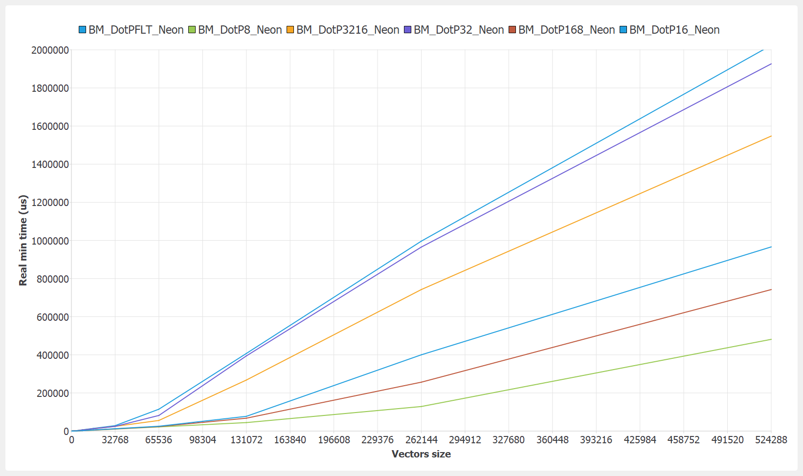
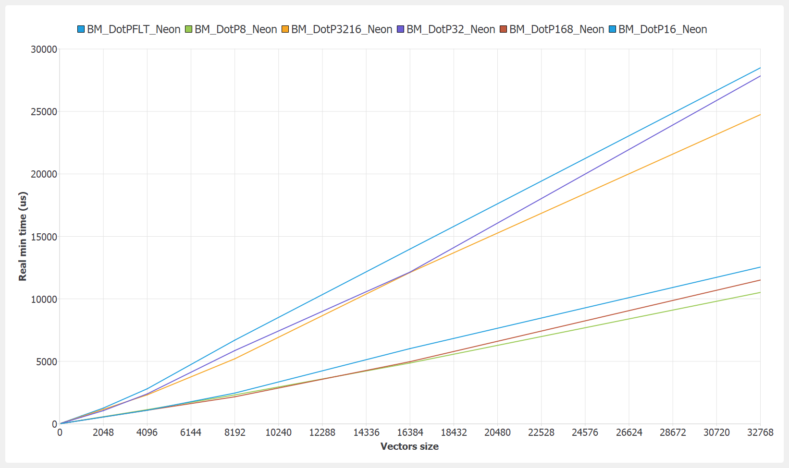
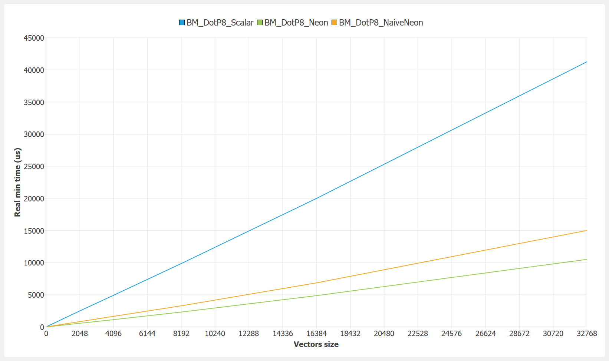
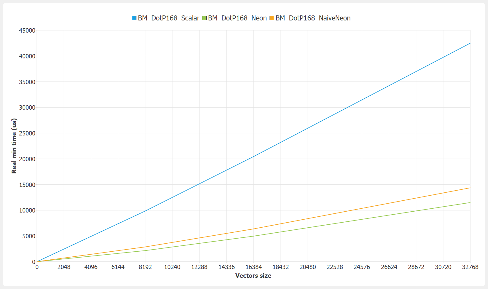
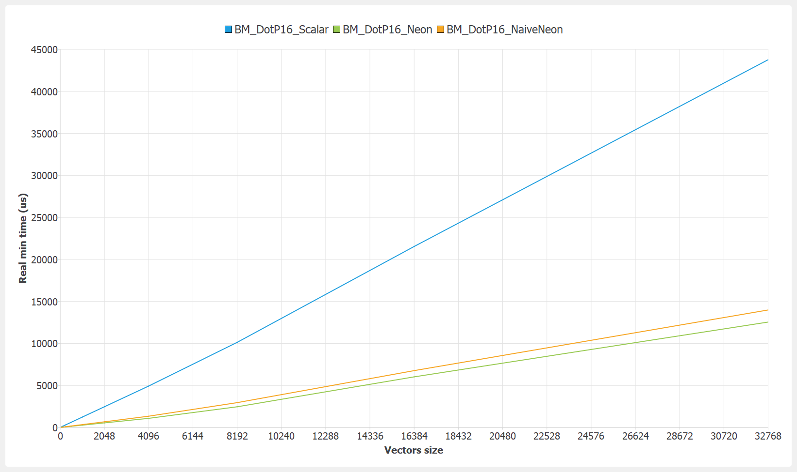
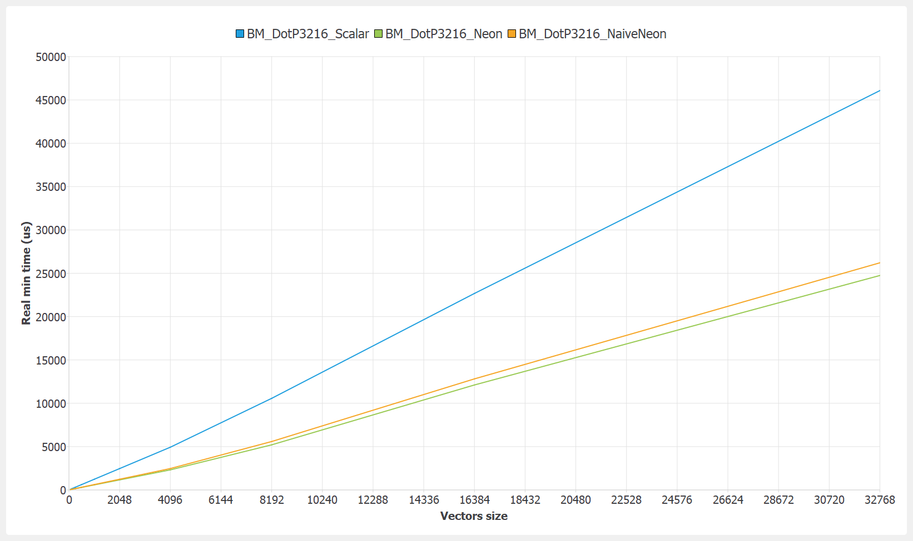
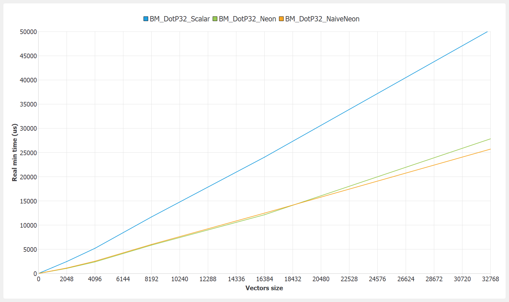
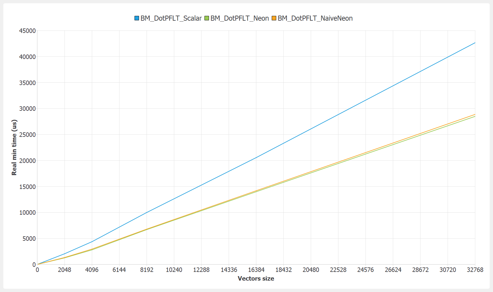

# Dot Product - ARM

Benchmark configuration:
- OS: Raspberry Pi OS 32-bits
- Compiler: GCC 8.3.0
- Flags: -O2 -DNDEBUG -march=armv7ve+simd -mfpu=neon-vfpv4
- CPU: Raspberry Pi 2 - BCM2836 (L1-D 32K, L2 256K) (overclocked @ 1000MHz)
- Options: no data alignement, max vector size multiple, inner loop '200'

### NEON

### int8 x int8

### int16 x int8

### int16 x int16

### int32 x int16

### int32 x int32

### float x float

