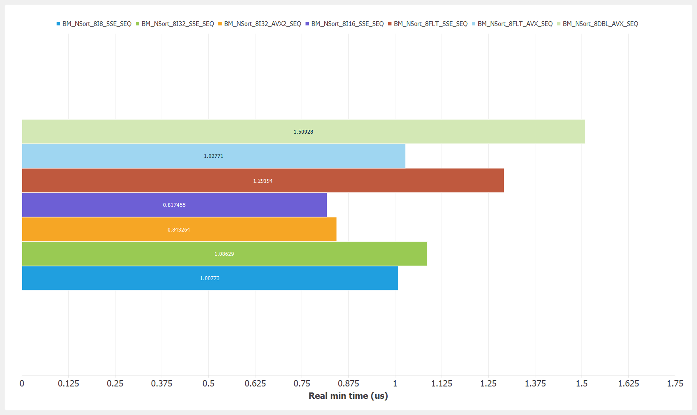
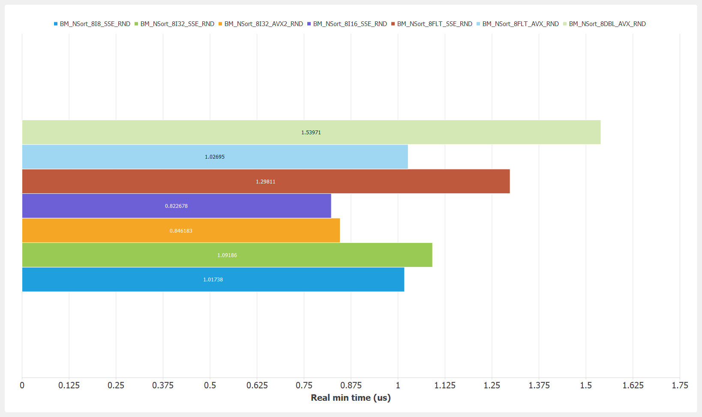
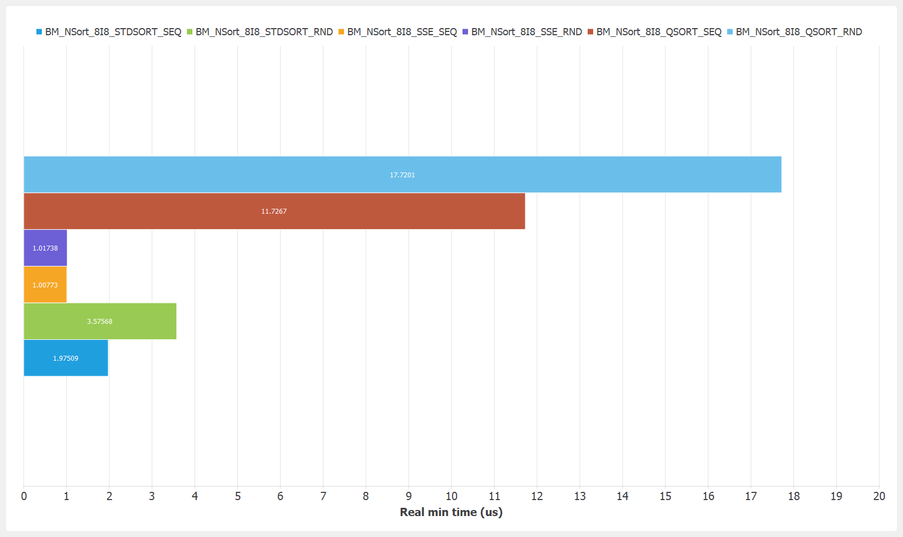
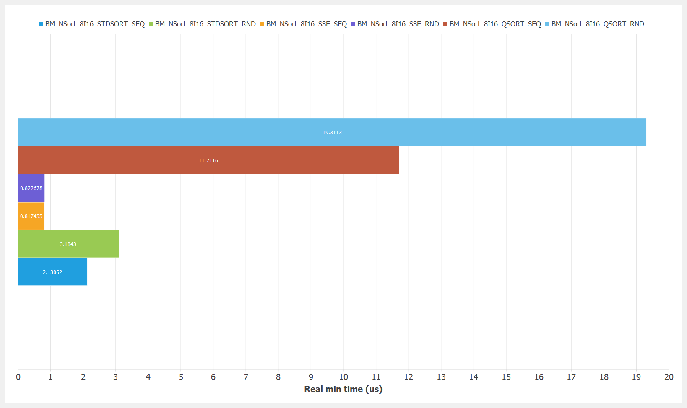
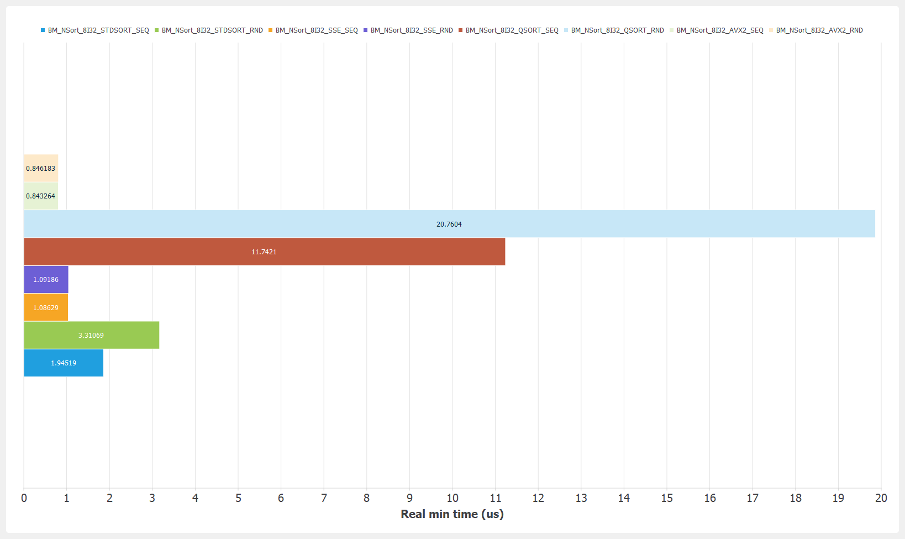
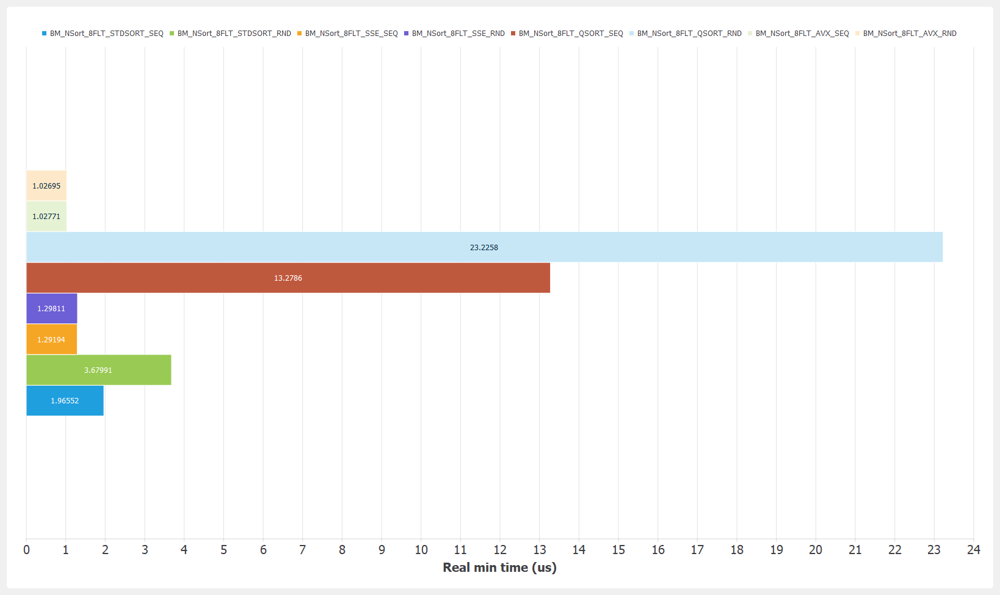
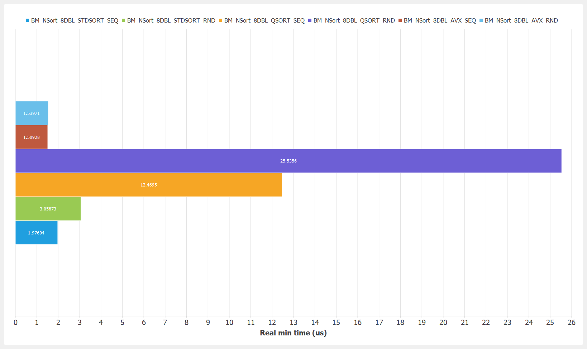

# NSort 8

Benchmark configuration:
- OS: Windows 10 64-bits
- Compiler: MinGW 8.1.0 64-bits
- Flags: -O2 -DNDEBUG -march=native -mtune=native
- CPU: i7-10875h (L1-D 32K, L1-I 32K, L2 256K, L3 16M) (turbo mode disabled)
- Options: no data alignement, no early exit, inner loop '100'

### Ordered

### Random

### int8

### int16

### int32

### float

### double

